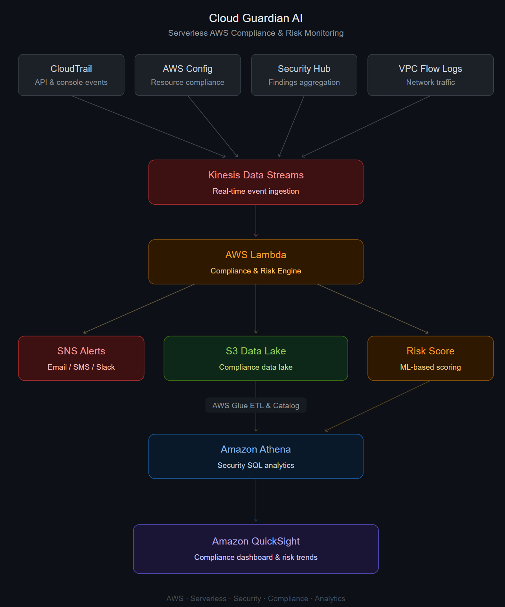
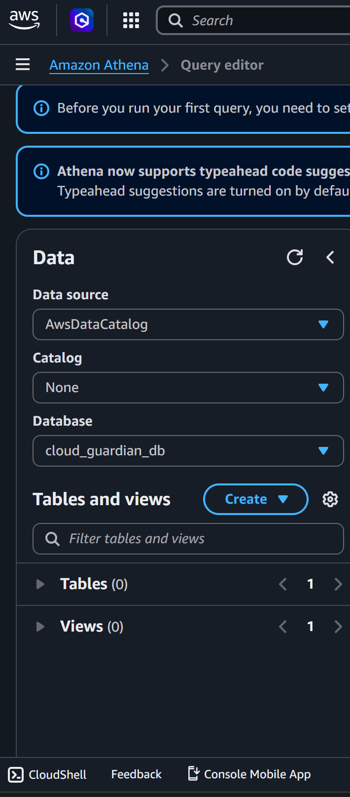
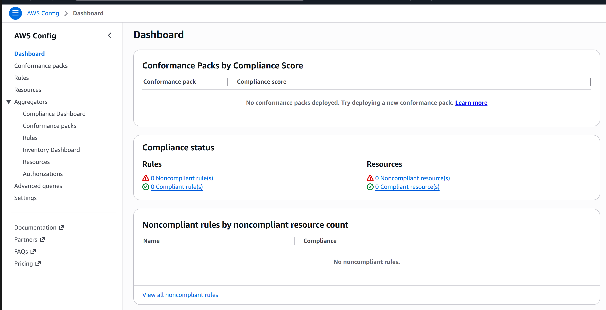

<div align="center">

# Cloud Guardian AI
### Serverless AWS Compliance & Security Monitoring Platform

A hands-on AWS security analytics platform demonstrating compliance evaluation, alerting, operational monitoring, audit visibility, and security analysis using AWS-native serverless services.


</div>

---

## Overview

Cloud Guardian AI is a serverless AWS security monitoring platform built to demonstrate practical implementation of compliance evaluation, security alerting, audit visibility, and findings analysis using AWS-native services.

The project focuses on real implementation evidence rather than theoretical architecture, showcasing how multiple AWS services work together to improve security visibility without managing servers.

---

## Architecture



---

## Platform Demonstration


The demonstration highlights the end-to-end workflow, including Lambda processing, SNS notifications, CloudWatch monitoring, Athena analytics, CloudTrail auditing, and AWS Config compliance visibility.

---

## Implemented Workflow

```text
Lambda Compliance Engine
        │
        ▼
Amazon S3 Findings Storage
        │
        ▼
AWS Glue Data Catalog
        │
        ▼
Amazon Athena Analytics
        │
        ▼
CloudWatch Monitoring

Critical Findings
        │
        ▼
Amazon SNS Email Alerts

Operational Activity
        │
        ▼
AWS CloudTrail

Compliance Visibility
        │
        ▼
AWS Config
```

---

## Key Features

| Feature | Description |
|-----------|-------------|
| Compliance Evaluation | Lambda-based security checks and event processing |
| Email Notifications | SNS alerts for critical findings |
| Findings Storage | Centralized S3 storage |
| Operational Monitoring | CloudWatch dashboards and metrics |
| Security Analytics | Athena query capabilities |
| Metadata Cataloging | AWS Glue integration |
| Audit Visibility | CloudTrail event tracking |
| Compliance Monitoring | AWS Config dashboards |
| Infrastructure as Code | Terraform provisioning |

---

## AWS Services Used

| Service | Purpose |
|----------|-----------|
| AWS Lambda | Compliance evaluation engine |
| Amazon S3 | Findings storage |
| Amazon SNS | Email notifications |
| Amazon CloudWatch | Monitoring and metrics |
| AWS Glue | Metadata catalog |
| Amazon Athena | Security analytics |
| AWS CloudTrail | Audit event tracking |
| AWS Config | Compliance visibility |
| Terraform | Infrastructure provisioning |
| IAM | Access management |

---

## Key Implementation Evidence

### Athena Security Analysis



### AWS Config Compliance Dashboard



---

## Repository Structure

```text
Cloud-Guardian-AI/
├── architecture/
│   └── architecture.png
├── lambda/
│   ├── compliance-engine.py
│   └── requirements.txt
├── terraform/
│   ├── main.tf
│   ├── variables.tf
│   └── outputs.tf
├── screenshots/
│   ├── cloud-guardian-demo.gif
│   ├── athena-security-analysis-results.png
│   ├── aws-config-compliance-dashboard.png
│   ├── cloudtrail-audit-events.png
│   ├── sns-security-alert-email.jpeg
│   ├── cloudwatch-monitoring-dashboard.png
│   ├── cloudwatch-metrics-overview.png
│   ├── lambda-functions-overview.png
│   ├── s3-findings-storage.png
│   └── supporting-evidence/
│       ├── athena-query-editor.png
│       ├── cloudwatch-execution-logs.png
│       ├── glue-crawler-configuration.png
│       ├── glue-data-catalog.png
│       ├── iam-security-role.png
│       ├── lambda-compliance-engine-code.png
│       └── aws-config-rules-overview.png
├── README.md
├── LICENSE
└── .gitignore
```

---

## Results

This project successfully demonstrated:

- Serverless compliance evaluation using AWS Lambda
- Email-based security alerting through Amazon SNS
- Centralized findings storage using Amazon S3
- Monitoring and metrics using CloudWatch
- Metadata cataloging with AWS Glue
- Security analytics using Athena
- Audit event tracking through CloudTrail
- Compliance visibility using AWS Config
- Infrastructure provisioning using Terraform

---

## Challenges Faced

- Managing IAM permissions across multiple AWS services
- Structuring findings for efficient Athena queries
- Integrating serverless services while maintaining simplicity
- Validating Lambda execution through CloudWatch logs
- Configuring CloudTrail and AWS Config within free-tier limitations
- Capturing implementation evidence without incurring unnecessary costs

---

## Deployment

### Prerequisites

- AWS Account
- Terraform >= 1.5
- AWS CLI configured
- Python 3.11+

### Deploy

```bash
git clone https://github.com/Sirikadali28/cloud-guardian-ai.git

cd cloud-guardian-ai

terraform init
terraform plan
terraform apply
```

> **Note:** Depending on AWS account settings and free-tier restrictions, certain IAM permissions and service configurations may require manual validation after deployment.

---

## Future Enhancements

- Integrate AWS Security Hub findings.
- Build QuickSight security dashboards.
- Add automated remediation workflows.

---

## Project Status

**Status:** Completed as a hands-on AWS security implementation and learning project.

---

## Author

**Siri**

Cloud Guardian AI demonstrates practical experience with AWS serverless security services, emphasizing compliance visibility, operational monitoring, and security analytics through real implementations.

---
